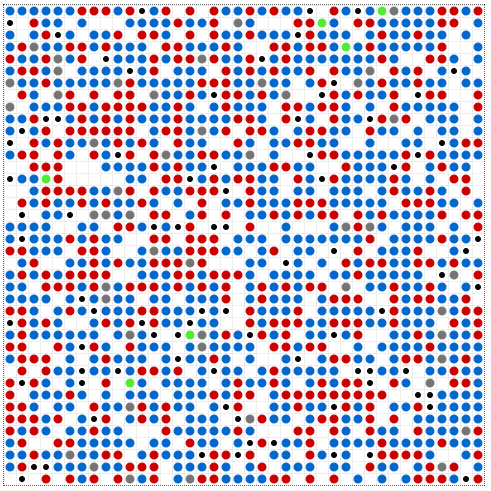

# ABM project of Dante de Lang, Louky Schutten, Caterina Buranelli, Ignas Krikštaponis and Kamiel Gulpen. 

## Epstein Civil Violence Model with an Media and Social Media component

## The model

The model is an extension of Epstein's civil violence model. Similar to Lemos et al. We broaden Epstein's Model with a delay in time before agents are imprisoned, representing the fighting time prior to an arrest and a feedback mechanism that allows the legitimacy to vary as a function of the number of arrests and violent episodes.
The purpose of the model is to introduce a network representing social media contacts in the extended version of the ABM of civil violence of Epstein. 

## How to Run

This repository contains 2 models, one model with a network which is in the ``epstein_civil_violence_Normal+Network Grid`` folder and one model without a network, which can be found in the ``epstein_civil_violence_NormalGrid`` folder. To run the model one must first choose which model he/she wants to run. 

The model can then be played by executing: ``run.py``

```
    $ python run.py
``` 

Then open your browser to [http://127.0.0.1:8521/](http://127.0.0.1:8521/) and press Reset, then Run. 




This shows how the agents move in the grid as shown above. The red dots represent the active citizens, the green dots the fighting citizens and the blue dots the quiscent citizens. The small black dots are the cops.

The data from the model can be retrieved by executing: ``model_run.py`` 

```
    $ python model_run.py
``` 
This will run the model for 200 iterations and returns a graph of the state of the citizens over time, a graph of the perceived legitimacy over time and features for analysing the results.

## Paper on the model
A more elaborate view of this model can be found in the paper .....

## Folders
* ``epstein_civil_violence_Normal+Network Grid``: In the Data, image and experiment folder files can be found which were used for the above mentioned paper.
* ``epstein_civil_violence_NormalGrid``: The data folder is used for experiments of the above mentioned paper.
* ``epstein_civil_violence`: This folder can be found in both above mentioned folders. In this folder the core model and agent code can be found.